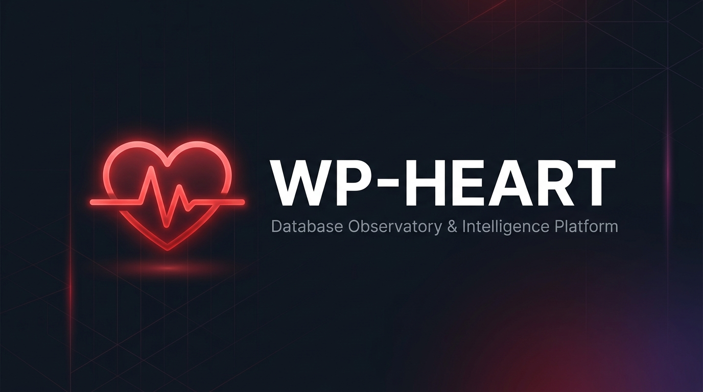

<div align="center">



<br/>

[](https://wordpress.org)
[](https://php.net)
[](https://www.gnu.org/licenses/gpl-2.0.html)
[](#testing)
[](#security)
[](RELEASE_REPORT.md)

<br/>

### *The pulse of your WordPress database — observed, not touched.*

**WP-HEART** is a zero-mutation, developer-first database observatory that gives you complete visibility into your WordPress database schema, health, data, and performance — all from the safety of a read-only platform.

[**Get Started**](#installation) · [**Features**](#features) · [**CLI**](#wp-cli) · [**REST API**](#rest-api) · [**Contributing**](#contributing)

</div>

---

## ✨ Why WP-HEART?

Every WordPress site accumulates database complexity over time — abandoned plugin tables, missing indexes, autoload bloat, orphaned data, schema drift. Traditional tools require direct DB access, risking accidental mutations. **WP-HEART changes that.**

**💡 Are you a plugin developer?** Read the [Developer's Guide to Anticipating Bugs](WHY_WP_HEART.md) to see how WP-HEART can supercharge your development workflow.

> *"Give developers the full power of database observability without ever giving them the power to break things."*

```
┌─────────────────────────────────────────────────────────────┐
│   WP-HEART  v1.6.0  —  356 tests passing  —  0 mutations    │
│   51 tables discovered  ·  142ms cold  ·  <1ms warm cache   │
│   23KB admin bundle  ·  Zero composer runtime dependencies   │
└─────────────────────────────────────────────────────────────┘
```

---

## 🚀 Features

<table>
<tr>
<td width="50%" valign="top">

### 🗄️ Database Discovery
Enumerate **every accessible table** — Core, Plugin, Theme, Unknown, and Legacy — with no assumptions about the `wp_` prefix. Custom prefixes and multisite networks supported out of the box.

### 🧠 Intelligence Classification
Evidence-backed ownership with confidence scores:
- `CORE` — WordPress native
- `PLUGIN` — Active or past plugin
- `THEME_CUSTOM` — Theme-specific
- `ORPHAN_CANDIDATE` — Owning plugin may be gone
- `UNKNOWN` — Needs investigation

### 🔬 Schema Inspector
Full schema visibility per table:
- Columns, data types, nullable, defaults
- Indexes (primary, unique, fulltext, composite)
- Foreign key constraints with cascade rules
- Physical and **inferred** relationships

</td>
<td width="50%" valign="top">

### ❤️ Health Diagnostics
12 built-in diagnostic checks with severity levels:

| Check | Severity |
|---|---|
| Missing Core Tables | `CRITICAL` |
| Missing Primary Key | `WARNING` |
| Unindexed References | `WARNING` |
| Autoload Size > 1MB | `WARNING` |
| Expired Transients | `INFO` |
| Engine Mix (MyISAM) | `INFO` |

### 📸 Schema Snapshots
Capture point-in-time metadata snapshots, compare any two snapshots for **Added / Removed / Changed** — tables, columns, indexes, constraints. Tamper-evident with hash integrity.

### 🤖 AI Query Engine
Describe what you need in plain English. WP-HEART generates and safely executes the corresponding SQL — validated by the same read-only policy as all other queries.

</td>
</tr>
</table>

---

## 🔒 Security — The Zero-Mutation Guarantee

WP-HEART makes a **categorical architectural promise**: it cannot mutate user data.

```php
// This can never happen in WP-HEART (hard-blocked at the policy layer):
// INSERT INTO ...
// UPDATE ...  SET ...
// DELETE FROM ...
// DROP TABLE ...
// ALTER TABLE ...
// TRUNCATE ...
```

**Security architecture highlights:**
- ✅ Server-side SQL policy denylist — `INSERT`, `UPDATE`, `DELETE`, `DROP`, `ALTER`, `TRUNCATE`, `CREATE` all blocked
- ✅ SQL comments stripped (prevents policy bypass)
- ✅ All identifiers allowlist-validated and backtick-quoted
- ✅ 40+ injection vectors tested: stacked statements, `INTO OUTFILE`, `LOAD_FILE`, CTE smuggling
- ✅ Error responses never expose raw DB error messages
- ✅ All 19 REST routes require explicit WordPress capability checks
- ✅ Read-only DB credentials degrade gracefully — audit and cache silently skip writes

---

## 📦 Installation

### Option 1 — Upload (Recommended)
```bash
# Download the release ZIP and upload via WP Admin → Plugins → Add New → Upload
```

### Option 2 — Manual
```bash
# Copy the wp-heart folder to your plugins directory
cp -r wp-heart /var/www/html/wp-content/plugins/
```

### Option 3 — Git Clone
```bash
cd wp-content/plugins/
git clone https://github.com/wittybrandcode/wp-heart.git
```

### Option 4 — Docker (Development)
```bash
git clone https://github.com/wittybrandcode/wp-heart.git
cd wp-heart
docker compose up -d
# Access WordPress at http://localhost:8080
```

**After activation:**
1. Navigate to **WP Admin → HEART**
2. The plugin seeds the `wp_heart_view_database` capability to Administrators automatically
3. No tables are created. No scan runs on activation. Zero footprint.

---

## 💻 WP-CLI

Full command-line access — ideal for CI pipelines, automated audits, and headless servers.

```bash
# Database overview
wp heart overview

# List tables with filters
wp heart tables --classification=PLUGIN --engine=InnoDB --format=json

# Run health diagnostics
wp heart health --severity=WARNING

# Search the database
wp heart search "billing_email" --tables=wp_posts,wp_postmeta

# Cron & scheduled task status
wp heart cron

# Autoload footprint
wp heart autoload

# Schema snapshots
wp heart snapshot_create --label="before-woocommerce-update"
wp heart snapshots
wp heart snapshot_diff snapshot-id-a snapshot-id-b
```

All commands support `--format=table|json|count`.

---

## 🌐 REST API

19 secured endpoints under `wp-heart/v1`:

```http
# Discovery & Schema
GET  /wp-json/wp-heart/v1/overview
GET  /wp-json/wp-heart/v1/tables
GET  /wp-json/wp-heart/v1/tables/{name}
GET  /wp-json/wp-heart/v1/tables/{name}/columns
GET  /wp-json/wp-heart/v1/tables/{name}/indexes
GET  /wp-json/wp-heart/v1/map

# Health & Diagnostics
GET  /wp-json/wp-heart/v1/health

# Data Browser
GET  /wp-json/wp-heart/v1/data
GET  /wp-json/wp-heart/v1/data/{id}

# Query Console
POST /wp-json/wp-heart/v1/query
POST /wp-json/wp-heart/v1/query/explain
POST /wp-json/wp-heart/v1/query/ai          # AI Assistant

# Search
GET  /wp-json/wp-heart/v1/search

# Snapshots
GET  /wp-json/wp-heart/v1/snapshots
POST /wp-json/wp-heart/v1/snapshots

# Observability
GET  /wp-json/wp-heart/v1/cron
GET  /wp-json/wp-heart/v1/audit
```

**Authentication:** WordPress Application Passwords or cookie nonce. All routes enforce capability checks.

### Example — AI Query via REST

```bash
curl -X POST https://yoursite.com/wp-json/wp-heart/v1/query/ai \
  -H "Authorization: Basic <app-password>" \
  -H "Content-Type: application/json" \
  -d '{"prompt": "show me the 10 largest options"}'
```

```json
{
  "data": {
    "rows": [...],
    "columns": ["option_name", "size"],
    "sql": "SELECT option_name, LENGTH(option_value) AS size FROM wp_options ORDER BY size DESC LIMIT 10"
  },
  "meta": {
    "row_count": 10,
    "elapsed_ms": 3.2,
    "read_only": true
  }
}
```

---

## 📊 Performance

| Scenario | Time |
|---|---|
| Cold table discovery (51 tables) | ~142ms |
| Warm cache hit | <1ms |
| Schema inspect (large table, 215k rows) | ~6.6ms |
| Paginated data read | ~1.2ms |
| Admin bundle size | **23KB** (zero runtime dependencies) |

---

## 🧪 Testing

```bash
# Full plain-PHP test suite (356 assertions, 20 groups)
php tests/run.php

# PHPUnit bridge
php vendor/bin/phpunit

# Static analysis
./vendor/bin/phpstan analyse src/ --level=5
./vendor/bin/phpcs --standard=WordPress src/
```

```
✅ Unit Tests        ·  356 / 356 PASS
✅ PHPStan Level 5   ·  Zero errors
✅ PHPCS WordPress   ·  Zero errors / warnings
✅ Live DB (51 tbls) ·  18 / 18 PASS
✅ Multisite         ·  19 / 19 PASS
✅ Security Vectors  ·  40+ injection attempts blocked
✅ Arabic i18n       ·   8 /  8 PASS
```

---

## 🏗️ Architecture

```
wp-heart/
├── src/WPHeart/
│   ├── Plugin/         # Bootstrap, DI container, Activator, Deactivator
│   ├── Database/       # WpdbAdapter (read-only), IdentifierValidator
│   ├── Discovery/      # Table enumeration, schema discovery
│   ├── Intelligence/   # Classification, CoreRecognizer, AIEngine
│   ├── Diagnostics/    # Health checks (12 checks, modular)
│   ├── Query/          # QueryExecutor, QueryValidator, QueryPolicy
│   ├── Snapshot/       # SnapshotStore (file-based), SchemaDiff
│   ├── Rest/           # 19 REST controllers, Presenter, TableAssembler
│   ├── Cli/            # HeartCommand (WP-CLI)
│   ├── Audit/          # AuditLogger, AuditStore (ring buffer)
│   ├── Cache/          # CacheService (transients + daily cleanup)
│   └── Config/         # Central configuration layer
├── assets/             # Compiled admin UI (23KB, zero runtime deps)
├── tests/              # 356-assertion test suite
├── languages/          # Arabic translation (RTL verified)
└── .github/workflows/  # CI/CD (PHP 7.4, PHPCS, PHPUnit)
```

**Key design decisions:**
- **Zero composer runtime dependencies** — ships as a self-contained ZIP
- **No custom database tables** — uses WordPress options/transients only
- **File-based snapshots** — stored in `uploads/wp-heart-snapshots/`, never in the DB
- **Graceful degradation** — read-only credentials, slow DB, or restricted environments all degrade silently

---

## 🌍 Compatibility

| Requirement | Version |
|---|---|
| WordPress | 6.2 – 7.1+ |
| PHP | 7.4 – 8.x |
| MySQL | 5.7+ |
| MariaDB | 10.4+ |
| Multisite | ✅ Full support |
| RTL / i18n | ✅ Arabic included |
| WP-CLI | ✅ Full command set |

---

## 📋 Changelog

### v1.6.0 — Schema Snapshots
- Metadata snapshots: capture, list, inspect, compare (Added / Removed / Changed on tables, columns, indexes, constraints)
- Export & validated import — file-based, never row content, tamper-evident
- WP-CLI snapshot commands: `create`, `list`, `delete`, `diff`

### v1.5.0 — WP-CLI & Cron
- Full WP-CLI command set: `overview|tables|health|search|cron|autoload`
- Cron observability: wp-cron + Action Scheduler awareness, overdue diagnostics
- Read-only index advisor (suggests, never creates)
- WordPress Site Health integration

### v1.4.0 — Autoload Audit
- Options autoload footprint diagnostics (512KB / 1MB thresholds)
- Expired transient waste detection
- Legacy and modern autoload scheme support

### v1.3.0 — Scoped Views
- Filter tables by owner plugin
- Owners directory endpoint
- Pagination preserves active filters

### v1.2.0 — Data Browser
- Row search within the data browser
- Engine filter on tables explorer
- Client-side CSV export
- Sister-site core recognition on multisite

### v1.1.0 — UI Redesign
- Unified dependency-free admin bundle
- Token-driven redesign, Row Inspector modal, query history
- Complete Arabic translation with RTL verification

### v1.0.0 — Initial Release
- Core Database Observatory

---

## 🤝 Contributing

Contributions are welcome! Please read the guidelines before submitting a PR.

```bash
# Clone the repository
git clone https://github.com/wittybrandcode/wp-heart.git
cd wp-heart

# Run tests before making changes
php tests/run.php

# Submit a PR targeting the `develop` branch
```

**CI runs automatically on every PR:**
- PHPCS (WordPress Coding Standards)
- PHPUnit test suite
- Static analysis (PHPStan level 5)

---

## 📄 License

WP-HEART is open source software licensed under the [GPL v2 or later](https://www.gnu.org/licenses/gpl-2.0.html).

---

<div align="center">

**Built with ❤️ for WordPress developers who deserve better database tooling.**

[⭐ Star this repository](https://github.com/wittybrandcode/wp-heart) · [🐛 Report a Bug](https://github.com/wittybrandcode/wp-heart/issues) · [💡 Request a Feature](https://github.com/wittybrandcode/wp-heart/issues)

</div>
